# 💙 OurWish

> 목표만 알려주면 내게 맞는 예·적금, 빠르게 찾아드릴게요.

**OurWish**는 기간과 금액, 우대조건을 입력하면 조건에 맞는 예·적금 상품을 추천하고, 예상 수령액과 상품 정보를 쉽게 확인할 수 있도록 돕는 AI 금융 서비스입니다.  
복잡한 금리 조건과 약관은 AI가 쉬운 말로 설명해주고, 가입 후에는 마이페이지에서 진행률과 만기 일정을 관리할 수 있습니다.

<br />

## 🔗 서비스 링크

| 구분        | 링크                   |
| ----------- | ---------------------- |
| 배포 사이트 | https://our-wish.site/ |

<br />

## 📌 목차

- [팀원 정보 및 역할 분담](#-팀원-정보-및-역할-분담)
- [서비스 주요 기능](#-서비스-주요-기능)
- [서비스 흐름](#-서비스-흐름)
- [기술 스택](#️-기술-스택)
- [프로젝트 구조](#-프로젝트-구조)
- [프론트엔드 컴포넌트 구조](#-프론트엔드-컴포넌트-구조)
- [시스템 설계 (설계서)](#-시스템-설계-설계서)
- [실행 방법](#-실행-방법)
- [금융 상품 추천 알고리즘 기술적 설명](#-금융-상품-추천-알고리즘-기술적-설명)
- [생성형 AI 활용 내용](#-생성형-ai-활용-내용)
- [프로젝트 후기 및 느낀 점](#-프로젝트-후기-및-느낀-점)

<br />

## 🧑🏻‍💻 팀원 정보 및 역할 분담

| 이름   | 담당          | 주요 역할                                                                               |
| ------ | ------------- | --------------------------------------------------------------------------------------- |
| 김주우 | Backend · AI  | Django REST API, DB 모델링, 금융 상품 데이터 처리, 추천 알고리즘, AI 기능 연동          |
| 안서진 | Frontend · AI | Vue 3 UI/UX, TypeScript, Pinia 상태관리, 반응형 화면 구현, 상품 추천/상세/마이페이지 UI |

<br />

<table>
  <tbody>
    <tr>
      <td align="center">
        <a href="https://github.com/kimzoo5676-del">
          
        </a>
      </td>
      <td align="center">
        <a href="https://github.com/xxj15">
          
        </a>
      </td>
    </tr>
    <tr>
      <td align="center">
        <a href="https://github.com/kimzoo5676-del"><b>김주우</b></a><br />
        Backend · AI<br />
        <sub>추천 알고리즘 · Django REST API · DB 모델링</sub>
      </td>
      <td align="center">
        <a href="https://github.com/xxj15"><b>안서진</b></a><br />
        Frontend · AI<br />
        <sub>Vue 3 UI/UX · Pinia 상태관리 · 반응형 디자인</sub>
      </td>
    </tr>
  </tbody>
</table>

<br />

## ✨ 서비스 주요 기능

### 🏠 랜딩 페이지

사용자가 서비스에 처음 진입했을 때 예금/적금 추천 기능으로 자연스럽게 이동할 수 있도록 구성했습니다.  
데스크탑과 모바일 화면을 각각 고려해 랜딩 화면을 분리하고, 목표 기반 금융 추천 서비스라는 핵심 메시지를 전달합니다.

|                   랜딩 페이지                    |
| :----------------------------------------------: |
| 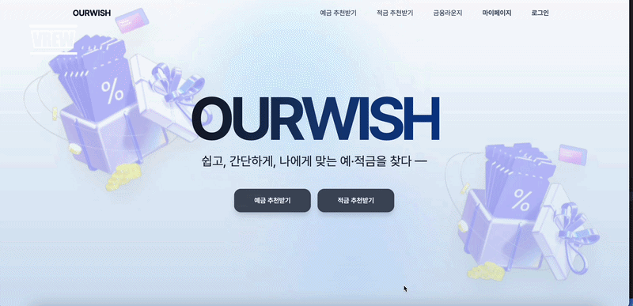 |

<br />

### 💰 예·적금 상품 추천

사용자가 기간, 금액, 우대조건을 입력하면 조건에 맞는 예·적금 상품을 추천합니다.  
적금과 예금은 납입 방식이 다르기 때문에 목표 설정 흐름을 분리했고, 사용자가 입력한 조건을 기준으로 예상 수령액을 계산할 수 있도록 구성했습니다.

#### 주요 기능

- 적금 / 예금 추천 플로우 분리
- 기간, 금액, 우대조건 입력
- 은행 및 상품 조건 필터링
- 세후 예상 수령액 계산
- 기본금리 / 최고금리 / 예상 수령액 기준 비교
- 선택한 우대조건을 모두 충족하는 상품 확인

|               목표 설정 STEP 1               |                목표 설정 STEP 2                |
| :------------------------------------------: | :--------------------------------------------: |
| 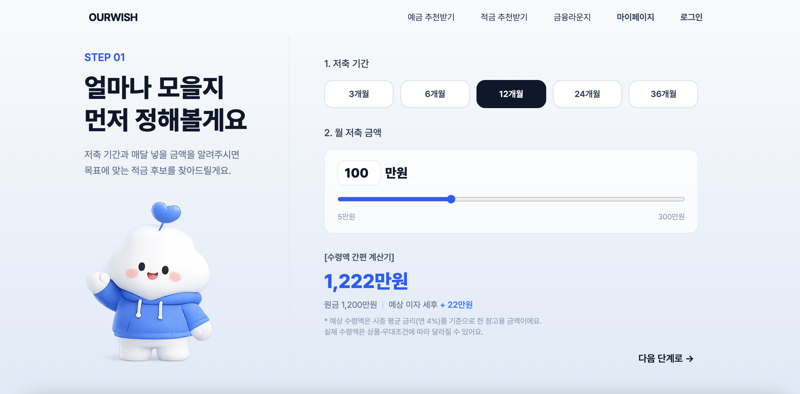 | 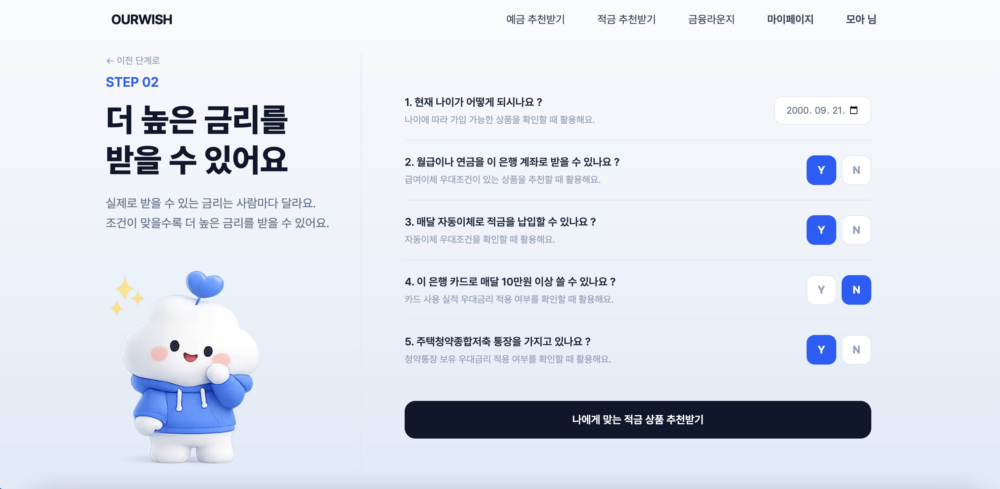 |

|                     상품 추천 결과                     |
| :----------------------------------------------------: |
| 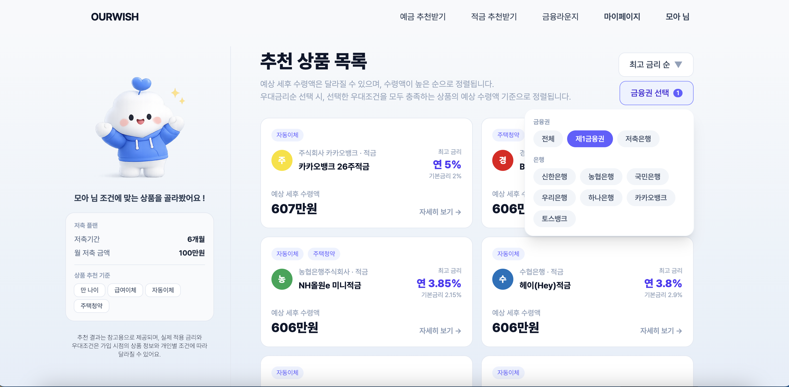 |

<br />

### 🔍 상품 상세

추천된 금융 상품의 상세 정보를 한 페이지에서 확인할 수 있습니다.  
금융감독원 원문 정보, 금리 정보, 우대조건, 세후 수익 계산, 영업점 검색, AI 챗봇을 함께 제공해 상품 이해부터 가입 전 확인까지 이어질 수 있도록 구성했습니다.

#### 주요 기능

- 상품 기본 정보 확인
- 기본금리 / 최고금리 확인
- 우대조건 및 가입 제한 정보 확인
- AI 쉬운말 상품 요약
- 예금 / 적금 세후 수익 계산
- 카카오맵 기반 영업점 검색
- 상품 관련 질문이 가능한 AI 챗봇
- 관심 상품 등록 및 해제

|                       상품 상세                        |
| :----------------------------------------------------: |
| 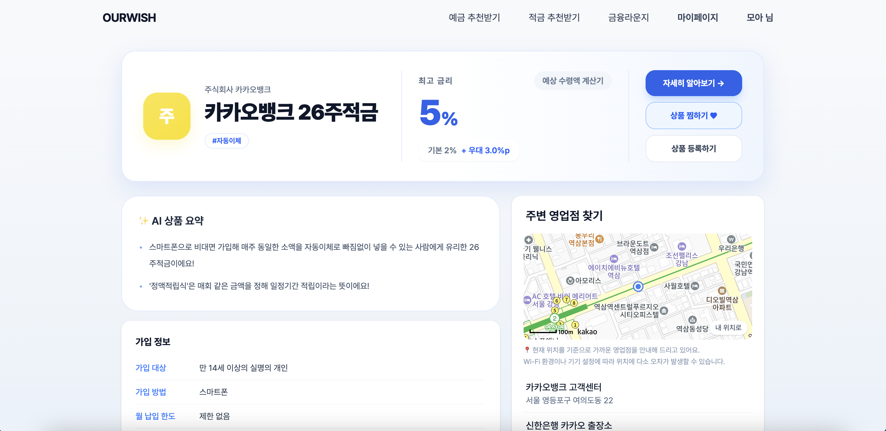 |

|                      상세 정보 1                       |                      상세 정보 2                       |                      상세 정보 3                       |
| :----------------------------------------------------: | :----------------------------------------------------: | :----------------------------------------------------: |
| 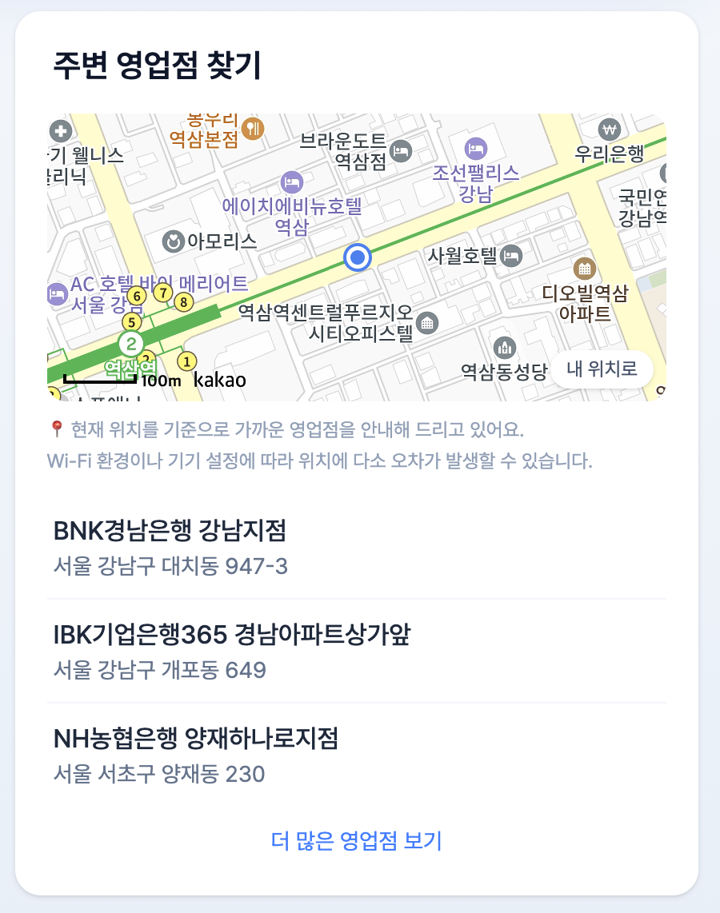 | 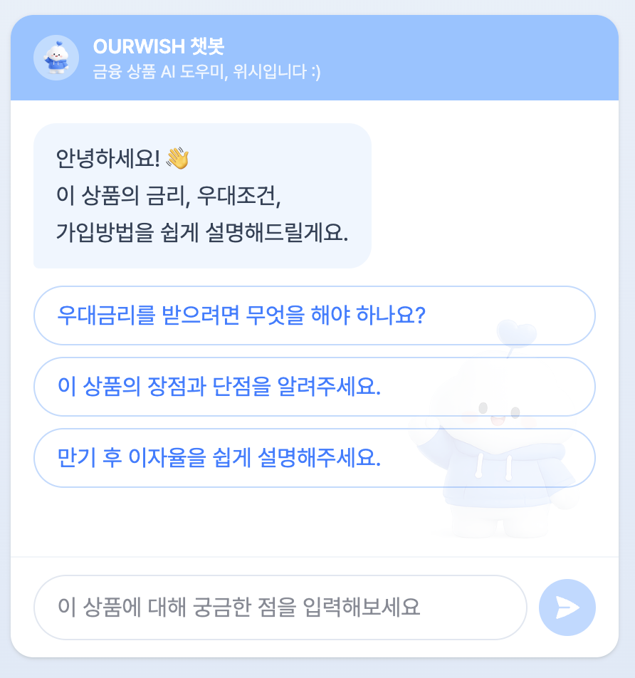 | 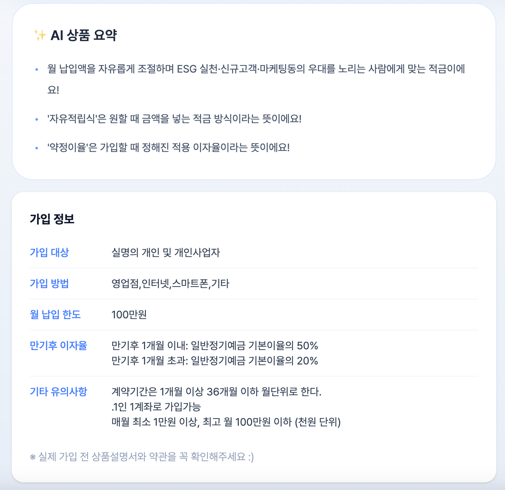 |

<br />

### 👤 마이페이지

사용자가 가입한 상품과 관심 상품을 관리할 수 있는 개인화 페이지입니다.  
가입 상품의 달성률, 만기 일정, 금리 비교 차트를 제공해 사용자가 자신의 저축 현황을 한눈에 확인할 수 있도록 했습니다.

#### 주요 기능

- 가입 상품 등록 및 관리
- 상품별 납입 진행률 확인
- 만기 일정 확인
- 내 금리 / 기본금리 / 최고금리 / 한국은행 평균금리 비교
- 관심 상품 목록 확인
- 시청한 금융 영상 확인
- 작성한 커뮤니티 글 확인

|               마이페이지 1               |               마이페이지 2               |
| :--------------------------------------: | :--------------------------------------: |
|  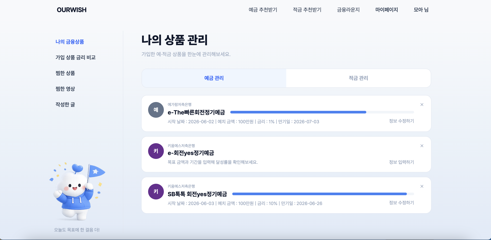  | 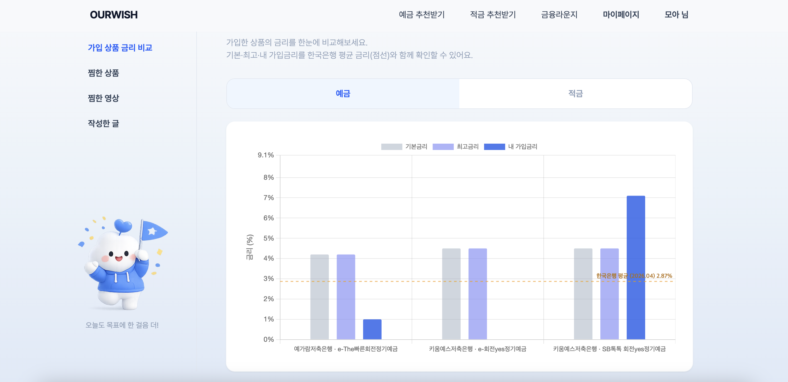 |
| 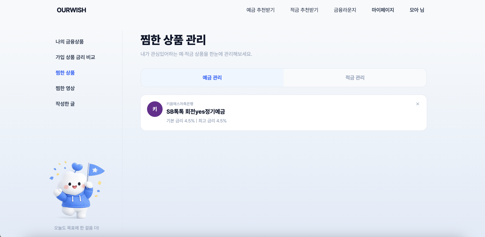 | 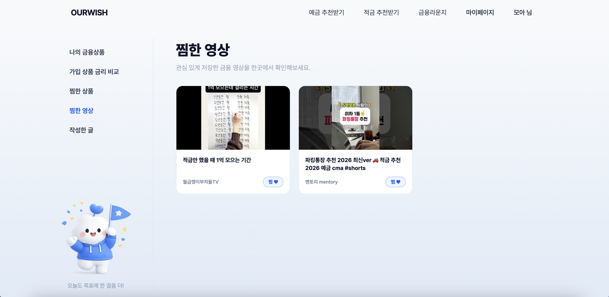 |

<br />

### 📺 금융 라운지

금융 관련 콘텐츠를 한곳에서 확인할 수 있는 페이지입니다.  
금융 유튜브 영상, 커뮤니티 글, 금·은 시세 차트를 제공해 사용자가 금융 정보를 가볍게 탐색할 수 있도록 구성했습니다.

#### 주요 기능

- 금융 유튜브 영상 목록 제공
- 영상 상세 페이지 제공
- 커뮤니티 피드 제공
- 금·은 시세 차트 제공
- 금·은 시세 기간 필터 — 시작일·종료일을 선택하면 해당 기간 데이터만, 선택하지 않으면 전체 기간을 표시
- 금융 정보 탐색 공간 제공

|                  금융 영상                   |                   금·은 시세                   |
| :------------------------------------------: | :--------------------------------------------: |
| 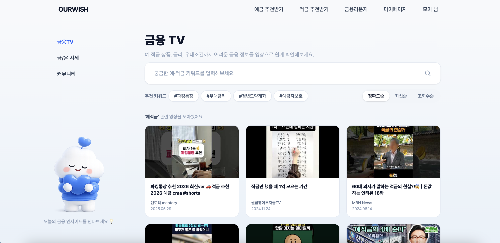 | 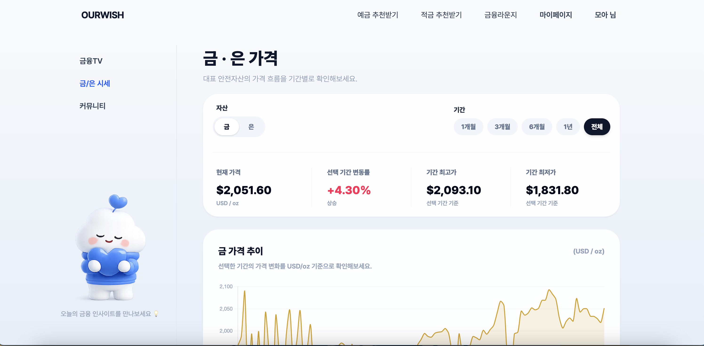 |

<br />

### 💬 커뮤니티

사용자가 금융 정보나 궁금한 점을 공유할 수 있는 게시판 기능입니다.  
게시글 작성, 수정, 상세 조회, 댓글 기능을 통해 사용자 간 금융 관련 소통이 가능하도록 구성했습니다.

#### 주요 기능

- 게시글 목록 조회
- 게시글 작성 및 수정
- 게시글 상세 조회
- 댓글 작성
- 마이페이지에서 작성 글 확인

|                   커뮤니티                   |
| :------------------------------------------: |
| 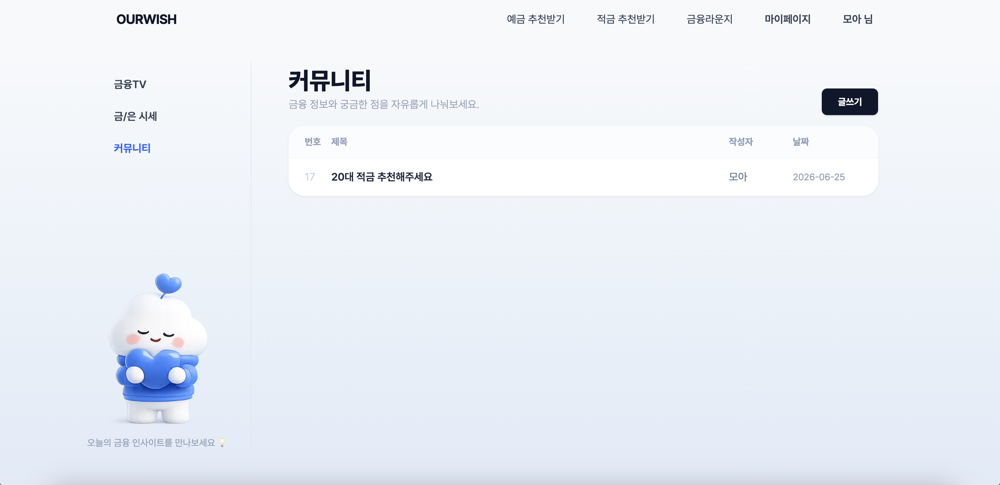 |

<br />

## 🧭 서비스 흐름

```txt
사용자 목표 입력
    ↓
예금 / 적금 선택
    ↓
기간, 금액, 우대조건 입력
    ↓
조건에 맞는 상품 필터링
    ↓
예상 수령액 계산
    ↓
추천 상품 리스트 제공
    ↓
상품 상세 정보 확인
    ↓
AI 요약 / 챗봇 / 영업점 검색
    ↓
관심 상품 또는 가입 상품 등록
    ↓
마이페이지에서 진행률과 만기 일정 관리
```

<br />

## 🛠️ 기술 스택

<br />

**Frontend**


<br />


<br />

**Backend**


<br />


<br />

**Infra & AI**


<br />


<br />

## 📁 프로젝트 구조

```txt
ourwish
├── frontend_dir
│   ├── public
│   ├── src
│   │   ├── assets
│   │   ├── components
│   │   ├── router
│   │   ├── stores
│   │   ├── views
│   │   └── main.ts
│   ├── package.json
│   ├── vite.config.ts
│   └── vercel.json
│
├── backend_dir
│   ├── apps
│   ├── config
│   ├── manage.py
│   └── requirements.txt
│
├── docs
│   ├── screenshots   # 실행 결과 캡처
│   └── diagrams      # 설계서 (아키텍처·시퀀스·ERD·컴포넌트·추천 알고리즘)
│
└── README.md
```

<br />

## 🧩 프론트엔드 컴포넌트 구조

```txt
App.vue
├── [레이아웃] Navbar.vue
│   └── EditProfileModal.vue
│       └── Chat.vue
│
├── [페이지] <RouterView>
│   ├── / → HomeView.vue
│   │   ├── LandingHero.vue
│   │   ├── LandingFeatures.vue
│   │   └── MobileLanding.vue
│   │
│   ├── /GoalSetup         → GoalSetupView.vue  (type: savings)
│   ├── /depositgoalsetup  → GoalSetupView.vue  (type: deposit)
│   │
│   ├── /recommendation        → RecommendationView.vue  (type: savings)
│   ├── /depositrecommendation → RecommendationView.vue  (type: deposit)
│   │   ├── ProductCard.vue
│   │   ├── BankFilterDropdown.vue
│   │   ├── FilterChips.vue
│   │   └── LevelInfoModal.vue
│   │
│   ├── /products/:id → SavingsDepositDetailView.vue
│   │   ├── ProductHeaderCard.vue
│   │   │   ├── DepositCalcModal.vue
│   │   │   └── SavingsCalcModal.vue
│   │   ├── ProductBasicInfo.vue
│   │   └── KakaoMap.vue
│   │       └── BranchMapModal.vue
│   │
│   ├── /mypage → MyPageView.vue
│   │   ├── SavingsCard.vue
│   │   ├── MarketRate.vue
│   │   ├── ProductsSection.vue
│   │   ├── WishlistSection.vue
│   │   ├── PostsSection.vue
│   │   ├── VideosSection.vue
│   │   └── EnrolledProductCard.vue
│   │       └── EnrollmentModal.vue
│   │
│   ├── /community/write    → CommunityWriteView.vue
│   ├── /community/:id/edit → CommunityWriteView.vue
│   ├── /community/:id      → CommunityPostDetailView.vue
│   │   └── CommentBody.vue
│   │
│   ├── /videos/:videoId → VideoDetailView.vue
│   │
│   └── /financelounge → FinanceLoungeView.vue
│       ├── VideoSection.vue
│       │   └── VideoCard.vue
│       ├── GoldSilverSection.vue
│       └── CommunitySection.vue
│
└── [오버레이] GlobalModals.vue
    ├── LoginModal.vue
    └── SignupModal.vue
```

<br />

## 📐 시스템 설계 (설계서)

### ◆ 전체 서비스 아키텍처

브라우저(Vue SPA · Vercel/CDN)와 백엔드(AWS EC2 · nginx → Django/DRF)의 구조, 그리고 외부 서비스(FSS · GMS · YouTube · ECOS · Kakao) 연동을 한눈에 정리한 구조도입니다.

|                전체 서비스 아키텍처                |
| :------------------------------------------------: |
| 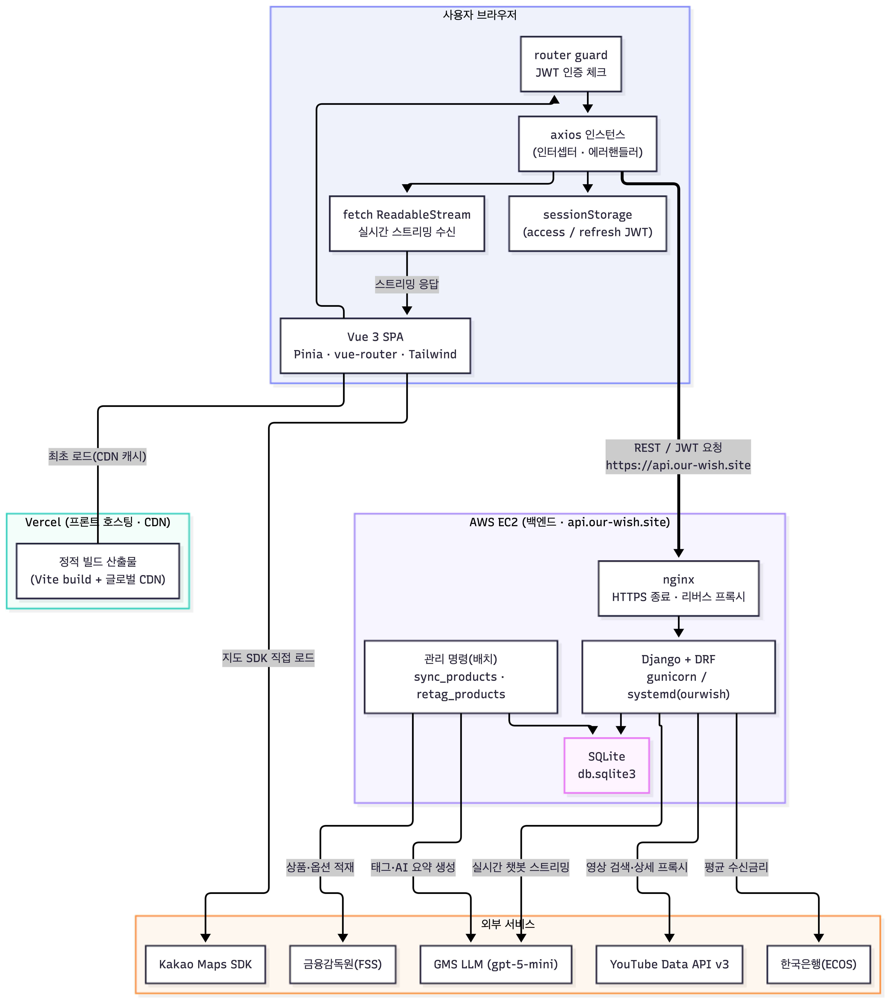 |

<br />

### ◆ 시퀀스 다이어그램 / API 흐름도

**① 인증 · 추천 (일반 REST 흐름)** — 로그인(JWT 발급)부터 조회 프로필 기반 추천 응답까지의 요청 흐름입니다.

|                       인증 · 추천 시퀀스                       |
| :------------------------------------------------------------: |
| 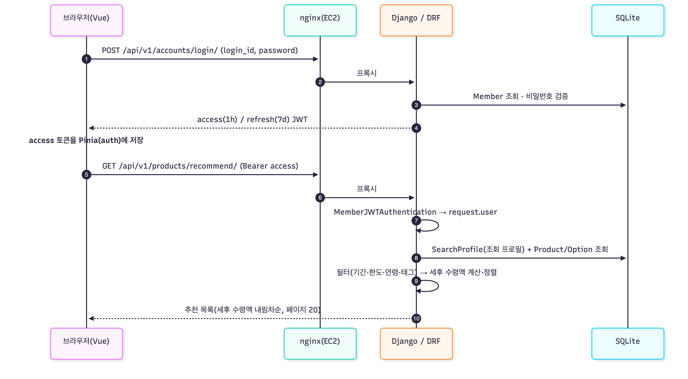 |

**② 상품 데이터 파이프라인 (배치 흐름)** — `sync_products --with-llm` 관리 명령이 FSS에서 상품을 수집하고 GMS LLM으로 태그·요약을 보강해 DB에 적재하는 배치 흐름입니다.

|                       상품 데이터 배치 시퀀스                        |
| :------------------------------------------------------------------: |
| 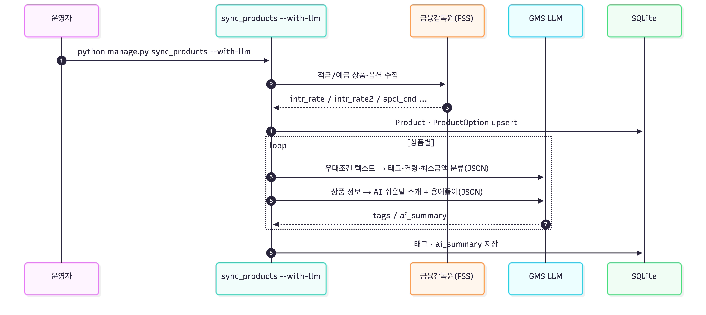 |

**③ AI 챗봇 (실시간 스트리밍 흐름)** — 상품 상세 챗봇이 GMS `stream=True` 응답을 `StreamingHttpResponse`로 받아 프론트로 실시간 전달하는 흐름입니다.

|                      AI 챗봇 스트리밍 시퀀스                       |
| :----------------------------------------------------------------: |
| 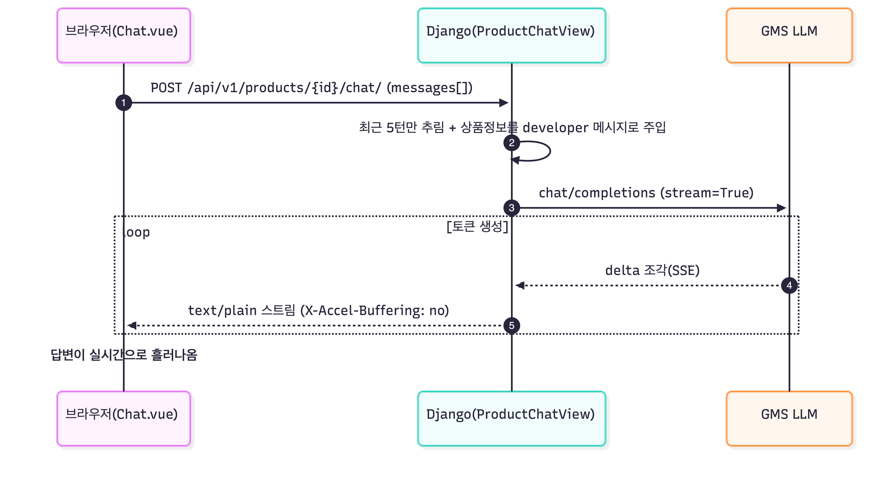 |

<br />

### ◆ 컴포넌트 구조도 (Vue 컴포넌트 트리)

진입점 → 페이지(Views) → 컴포넌트 → 상태(Pinia) 순으로 의존 관계를 정리한 프론트엔드 구조도입니다. (텍스트 트리는 [프론트엔드 컴포넌트 구조](#-프론트엔드-컴포넌트-구조) 참고)

|                   컴포넌트 구조도                    |
| :--------------------------------------------------: |
| 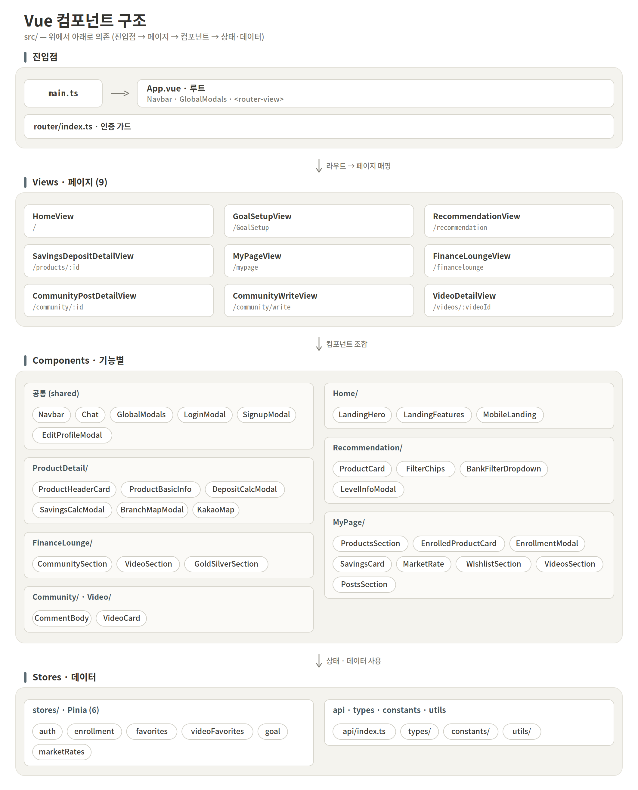 |

<br />

### ◆ DB 모델링 (ERD)

회원·조회 프로필·상품·옵션·가입·찜·커뮤니티 등 전체 엔티티와 관계를 나타낸 ERD입니다.

|              ERD              |
| :---------------------------: |
|  |

<br />

### ◆ 추천 알고리즘 상세 설계 및 의사결정 과정

**설계 흐름** — 조회 프로필 로드부터 필터 → 우대조건 매칭 → 세후 수령액 정렬 → 화면 표시까지의 파이프라인입니다. (상세 설명은 [금융 상품 추천 알고리즘 기술적 설명](#-금융-상품-추천-알고리즘-기술적-설명) 참고)

|                      추천 알고리즘 설계 흐름                      |
| :---------------------------------------------------------------: |
| 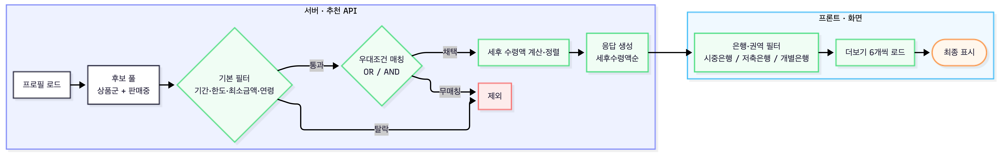 |

**의사결정 과정** — "사용자가 그래서 얼마 받는지"를 직관적으로 보여준다는 방향성과, 이를 위해 채택/배제한 기술 의사결정(판매중만 · LLM 태그 분류 · OR 매칭 등)을 정리했습니다.

|                        추천 알고리즘 의사결정                        |
| :------------------------------------------------------------------: |
| 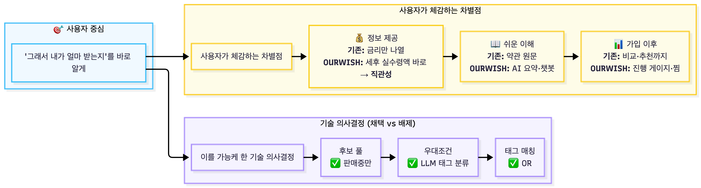 |

<br />

## 🚀 실행 방법

### 1. Repository Clone

```bash
git clone https://github.com/Our-Wish/ourwish.git
cd ourwish
```

<br />

### 2. Frontend 실행

```bash
cd frontend_dir
npm install
npm run dev
```

<br />

### 3. Backend 실행

```bash
cd backend_dir
python -m venv venv
source venv/bin/activate
pip install -r requirements.txt
python manage.py migrate
python manage.py loaddata products   # 예·적금 상품 데이터(766건) 적재
python manage.py runserver
```

> `loaddata products`는 `backend_dir/apps/products/fixtures/products.json`(금융감독원 수집 + AI 가공 완료 상품 766건)을 DB에 넣습니다. 이 데이터로 추천·상세·AI 요약 기능을 바로 확인할 수 있습니다.

Windows 환경에서는 아래 명령어로 가상환경을 활성화할 수 있습니다.

```bash
venv\Scripts\activate
```

<br />

### 4. 환경변수 설정

실행을 위해 프론트엔드와 백엔드에 필요한 환경변수를 설정해야 합니다.

#### Frontend `.env`

```env
VITE_API_BASE_URL=
VITE_KAKAO_MAP_KEY=
```

#### Backend `.env`

```env
SECRET_KEY=
DEBUG=
ALLOWED_HOSTS=
CORS_ALLOWED_ORIGINS=

FSS_API_KEY=
ECOS_API_KEY=
YOUTUBE_API_KEY=
GMS_KEY=
```

> API Key와 Secret Key는 GitHub에 업로드하지 않습니다.

<br />

## 💡 금융 상품 추천 알고리즘 기술적 설명

OurWish의 상품 추천 로직은 다음과 같습니다.

- **사용자 조회 프로필 기반의 필터링**
- **세후 실수령액 정렬**

예금, 적금 상품의 특성상 **우대 조건에 따라 금리가 변동**됩니다.
사용자는 조회 프로필을 통해 **내가 얼마를 받는지** 직관적으로 확인할 수 있습니다.

### 1. 입력 - 조회 프로필(SearchProfile)

사용자는 STEP1·STEP2에서 입력한 값을 조회 프로필로 저장하고, 추천은 매번 이 프로필을 읽어 동작합니다.

- 저축 기간 (`save_term`)
- 금액 — 적금은 월 납입액(`monthly_amount`), 예금은 예치금(`deposit_amount`)
- 만 나이 — 생년월일(`birth_date`)로 계산
- 우대조건 충족 여부 — 사용자가 충족 가능한 조건(태그)

### 2. 후보 - 상품군 분리(예금, 적금) + 공시 종료 상품 제외

- `product_type`으로 적금 / 예금 트랙을 분리합니다.
- 공시 종료일(`dcls_end_day`)이 지난(판매 종료) 상품은 제외합니다. 가입할 수 없는 상품을 추천하지 않기 위함입니다.

### 3. 조회 프로필 기반 필터

후보 상품을 다음 순서로 정리합니다.

- **기간**: 사용자가 고른 저축 기간에 해당하는 금리 옵션이 있는 상품만
- **납입 한도**: 사용자의 금액이 상품 최대 한도(`max_limit`)를 넘지 않는 상품만
- **최소 금액**: 사용자의 금액이 상품 최소 가입금액(`min_limit`) 이상인 상품만
- **연령**: 상품의 가입 연령 제한(`age_min` / `age_max`) 범위에 드는 상품만

### 4. 우대조건 태그 매칭

사용자가 충족 가능한 우대조건(태그)과 상품이 제공하는 우대조건 태그를 비교합니다. 상품의 우대조건 원문은 LLM 배치로 표준 태그(boolean)로 미리 구조화해 둡니다(아래 [생성형 AI 활용 내용](#-생성형-ai-활용-내용) ① 참고).

- 실시간이 아니라 왜 미리 배치할까?
  - **필터링 가능성**: 태그는 추천의 필터 조건으로 쓰입니다. 자유 텍스트는 SQL로 거를 수 없지만, 미리 boolean 컬럼으로 박아두면 766개 상품을 DB 쿼리 한 번으로 즉시 걸러냅니다.
  - **응답 속도·비용**: 추천 요청마다 수백 개 상품의 우대조건을 LLM에 물으면 응답이 수십 초로 느려지고 호출 비용도 커집니다. 상품당 한 번만 구조화해 두면, 추천은 순수 DB 쿼리·계산만으로 즉시 응답합니다.
- **상품군별 태그 분리**: 적금은 `급여이체·자동이체·카드실적·청약`, 예금은 `첫거래·비대면가입·마케팅동의·재예치`로 매칭에 쓰는 태그 집합이 다릅니다(상품군마다 의미 있는 우대조건이 달라서).
- **기본(OR)**: 고른 조건 중 **하나라도** 충족하면 추천합니다. 우대 태그를 가진 상품이 데이터상 희소해, AND로 묶으면 결과가 0건이 되는 것을 방지합니다. 우대조건이 아예 없는(기본 금리가 높은 상품이 있을 수도 있으니) 상품도 함께 통과시킵니다.
- **전체 충족(AND)**: 정렬 옵션이 "모든 우대조건 충족"일 때만 전환되어, 고른 조건을 **전부** 충족하는 상품만 남깁니다.
- 매칭된 태그는 추천 카드에 **칩**으로 노출돼, 사용자가 "내가 고른 조건 중 무엇이 충족됐는지" 바로 확인할 수 있습니다.

### 5. 세후 예상 수령액 계산

필터를 통과한 상품마다 만기 시 실수령액을 계산합니다.

- **이자소득세 15.4%**를 공제한 실수령액 기준
- **단리 / 복리**(`intr_rate_type`)에 따라 계산식을 분기
- 적금(적립식)은 월 납입 누적, 예금(거치식)은 일시 예치로 이자 구조가 달라 각각 계산

### 6. 정렬 - 세후 실수령액 기준

- 기본 정렬은 **세후 실수령액 내림차순**입니다. 금리는 단·복리, 적금/예금 구조에 따라 같은 숫자라도 실수령액이 달라집니다.
- 사용자가 실제로 받는 금액으로 줄세우는 것이 직관적입니다.
- 기본금리 / 최고금리 정렬 옵션도 함께 제공합니다.

### 7. 외부 금융 데이터 수집 흐름

- 금융감독원(FSS) API에서 적금/예금 상품·금리 옵션을 수집해 `Product` / `ProductOption`에 적재합니다(관리 명령 배치).
- 우대조건 태그·연령·최소금액·AI 요약은 LLM 배치로 보강합니다(아래 [생성형 AI 활용 내용](#-생성형-ai-활용-내용) 참고).

<br />

## 🤖 생성형 AI 활용 내용

OurWish는 **GMS(SSAFY OpenAI 호환 프록시)의 `gpt-5-mini`** 모델을 Django에서 직접 호출해 세 가지에 활용합니다.
태그·요약은 배치로 미리 가공하고, 챗봇만 사용자 요청 시 실시간으로 호출합니다.

| 활용                     | 성격             | 목적                                      |
| ------------------------ | ---------------- | ----------------------------------------- |
| ① 우대조건 → 태그 구조화 | 배치             | 비정형 텍스트를 추천 필터용 데이터로 변환 |
| ② 쉬운말 요약·용어 풀이  | 배치             | 어려운 금융 약관을 사회초년생 눈높이로    |
| ③ 상품 상세 AI 챗봇      | 실시간(스트리밍) | 상품 데이터에 근거한 실시간 Q&A           |

### ① 우대조건 → 태그 구조화 (정보 추출)

금융감독원이 주는 우대조건(`spcl_cnd`)은 은행마다 표현이 다른 **자유 텍스트**라, 정규식·키워드 규칙으로는 누락·오탐되기 쉽습니다.
LLM에 우대조건·가입 대상·기타 유의사항을 주고 **8개 표준 태그 + 연령 제한 + 최소 가입금액을 JSON으로 추출**합니다.

- 기법: Few-shot(퓨샷 예시) + Structured Output(`response_format: json_object`)
- 할루시네이션 방지: "원문에 근거가 있을 때만 태그를 켠다(추측·과잉판단 금지)"는 규칙과 데이터를 확인하여 "사원증=카드실적 아님" 같은 함정 예시를 프롬프트에 박아 오탐을 줄였습니다.
- 예시: `"가입금액 최저 1백만원이상"`(원문) → `min_limit = 1000000`(구조화)
- 추출된 태그·연령·최소금액이 그대로 추천 필터의 입력이 됩니다.

### ② 쉬운말 요약 + 용어 풀이

약관을 다 읽지 않아도 "이 상품이 어떤 분께 좋은지"를 한 줄로 알 수 있게, 상품 정보를 **페르소나처럼** 풀어 줍니다.

사회초년생에게 어려울 수 있는 금융 용어(평잔·약정이율 등)는 따로 골라 쉬운 뜻을 붙입니다.

- **출력 제약(controlled generation)**: 80자 이내·`~요!`로 끝맺음·`%p·금액·기간 같은 숫자 금지`·생활 패턴 중심. 좋은 예/나쁜 예와 퓨샷으로 문체와 형식을 고정합니다.
- **LLM과 규칙 코드의 역할 분리**: LLM은 `{용어, 뜻}`만 생성하고, "'평잔'은 ~라는 뜻이에요!" 같은 친절 문장과 한국어 조사(은/는·라는/이라는)는 파이썬이 **한글 받침을 유니코드 연산**(`(ord(글자) - 0xAC00) % 28`)으로 계산해 직접 붙입니다 → '평잔란' 같은 맞춤법 오류를 원천 차단합니다.

### ③ 상품 상세 AI 챗봇 (근거 기반 생성)

상품 상세에서 사용자가 자유롭게 질문하면 해당 상품 데이터를 근거로 실시간 답변합니다. **동적 컨텍스트 주입 + 네거티브 프롬프팅**으로 답변 범위를 상품 안에 가둡니다.

- **근거 한정(grounding)**: 그 상품 정보를 `developer` 메시지에 동적으로 주입하고, 정보에 없는 내용은 "제공된 정보에 없어요"라고 답하도록 가드레일을 설정해 할루시네이션을 방지합니다. 상품과 무관한 질문(예: "○○ 주가 알려줘")은 정중히 상품 관련 질문으로 되돌립니다.
- **과장 차단(네거티브 프롬프팅)**: 가입 권유·수익 보장·단정 표현을 금지합니다.
- **스트리밍**: GMS `stream=True`로 토큰을 SSE 조각으로 받아 백엔드 `StreamingHttpResponse`로 즉시 흘려보내고(`X-Accel-Buffering: no`), 프론트는 `fetch`의 ReadableStream으로 실시간 렌더링합니다.
- **비용·지연 가드**: 대화는 프론트가 보관(stateless)하고, 백엔드는 최근 5턴만 잘라 호출합니다.

### 공통 - GPT-5 호출 설정

- **`temperature` 미전송** — gpt-5는 커스텀 값을 주면 400 오류를 반환하므로 생략
- **`response_format: json_object`** 로 배치 작업의 출력을 안정화
- **`reasoning_effort: "low"`** — 단순 분류/요약 작업이라 속도·비용 절감
- 모든 API 키는 백엔드(`.env`)에만 두고 외부에 노출하지 않습니다.

<br />

## 💬 프로젝트 후기 및 느낀 점

### 김주우

첫 팀 프로젝트를 진행하며 가장 크게 배운 것은 두 가지다.

**1. 기획이 탄탄해야 다음 진행 사항들이 구체화된다.**

기획이 단단해야 ERD 설계나 User Flow가 명확해지고, 그 구체화된 내용을 바탕으로 코드를 설계할 수 있다고 느꼈다.

**2. 가정하지 말고, 실제 데이터를 직접 확인해야 한다.**

이번 프로젝트에서 기획을 전면 수정한 경험이 이 교훈을 가장 강하게 남겼다.

처음에는 자유 텍스트인 우대조건을 정규식·키워드 규칙으로 추출하려 했다. 하지만 은행마다 표현이 제각각이라 누락과 오탐이 심했고, 대표적으로 두 가지 문제가 있었다.

- **조건이 아닌 문구를 조건으로 오인** - 예를 들어 `"최대 연 5.0% 우대금리가 적용돼요"`는 사용자가 체크할 수 있는 조건이 아니라 상품의 최대 우대금리를 요약한 홍보 문구다. 이게 조건으로 추출되면 프론트엔드에는 존재하지 않는 조건이 체크박스로 노출되고, 우대조건 난이도까지 잘못 표시됐다.
- **중복 적용 불가 조건을 단순 합산** - 일부 우대조건은 동시에 받을 수 없다(예: 첫거래 우대와 장기미거래 우대는 중복 불가). 또 `"3.5%(고시금리 포함)"`처럼 기본금리가 이미 포함된 값을 순수 우대금리로 처리하면 기본금리가 중복 계산된다. 이 경우 우대금리가 실제보다 과도하게 커지고, 그 위에서 계산되는 `expected_rate`·예상 수령액·정렬 결과까지 모두 왜곡됐다.

결국 모든 우대조건을 빠짐없이 구조화하겠다는 욕심을 버려야 했다. 주어진 토큰(API 예산)의 절반쯤을 쓴 시점에, 남은 예산으로 전부 처리하기는 어렵다고 판단했기 때문이다. 대신 실제 데이터를 직접 확인하며 가장 빈번한 보편 우대조건만 추려 표준 태그로 정했고, 금리도 합산하지 않고 FSS가 주는 기본, 최고금리만 신뢰하도록 바꿨다. 이후로는 추측 대신 데이터를 수시로 확인하며 진행했다.

협업 과정에서는 Git Flow 전략을 적용해 브랜치 단위로 기능을 관리했고, 노션을 통해 회의 내용과 의사결정을 기록해 팀 내 커뮤니케이션 효율을 높였다. Figma 와이어프레임 설계 단계부터 참여하며 기획 의도를 기술적으로 구현하기 위해 팀원들과 논의하는 과정도 거쳤다.

특히, GitHub Actions로 CI/CD 파이프라인을 구축하여 빌드와 배포 자동화를 구현했다. AWS EC2 환경에 서버를 올리고 실제 도메인을 연결하여 서비스를 배포하기까지, 로컬 개발 환경에서 프로덕션 단계로 넘어가는 서비스 생명주기 전체를 직접 경험하며 실무적인 배포 역량을 익힐 수 있었다.

<br />

### 안서진

기획부터 개발, 배포까지 약 7주간 관통 프로젝트를 진행했다.
처음에는 금융 도메인 지식뿐만 아니라 Vue, Django, AI 활용까지 모두 낯설어 막막함이 컸다. 하지만 프로젝트를 진행하며 하나씩 학습하고 적용해나간 결과, 만족할 만한 결과물을 완성할 수 있어 뿌듯했다.

이번 프로젝트에서는 단순히 프론트엔드 화면을 구현하는 것을 넘어, 사용자 경험을 고려한 기획과 디자인, 백엔드와의 API 협업, 추천 로직, 배포 구조까지 프로젝트 전반의 흐름을 이해할 수 있었다.

중간에 기획을 수정하고 디자인을 다시 구성하는 과정은 쉽지 않았지만, 팀원과 적극적으로 소통하며 더 나은 방향을 찾아갈 수 있었다. 힘든 순간도 많았지만 그만큼 많이 배웠고, 함께 끝까지 완성해낸 경험이 오래 기억에 남을 것 같다.

이번 프로젝트를 통해 낯선 기술과 도메인도 직접 부딪히며 해결해나갈 수 있다는 자신감을 얻었다. 힘들었지만 즐거웠고, 마무리할 수 있어 후련하고 뿌듯한 프로젝트였다.

<br />
