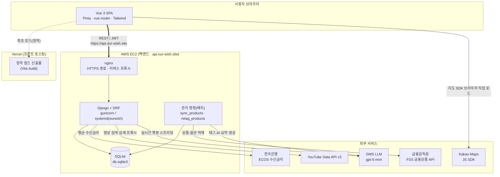
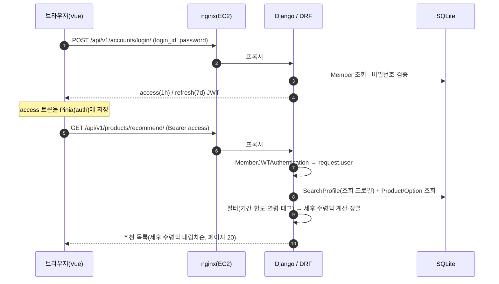
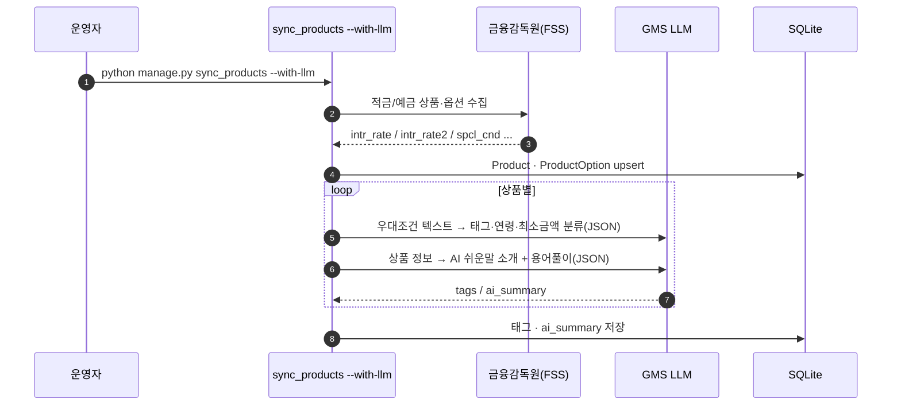
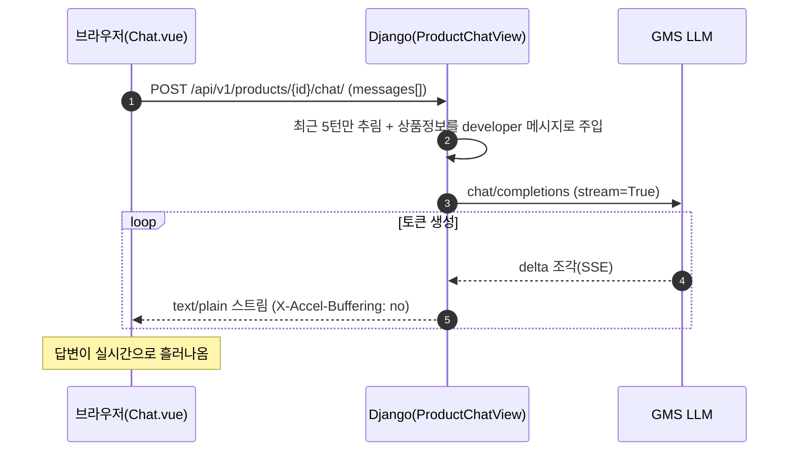

# OurWish 시스템 아키텍처

> 사회초년생을 위한 **적금·예금 추천 / 관리** 서비스.
> 프론트(Vercel) ↔ 백엔드(EC2) 분리 배포, 외부 금융·AI 서비스 연동.

---

## 1. 기술 스택

| 영역 | 기술 |
| --- | --- |
| 프론트엔드 | Vue 3 (`<script setup>`) · TypeScript · Pinia · vue-router · Tailwind CSS v4 · Chart.js |
| 빌드/호스팅 | Vite · **Vercel** |
| 백엔드 | Django 5.2 · Django REST Framework · drf-spectacular(Swagger) |
| 인증 | 커스텀 JWT (`MemberJWTAuthentication`, access 1h / refresh 7d) |
| 데이터베이스 | SQLite (`db.sqlite3`) |
| 서버/배포 | **AWS EC2** · nginx(HTTPS 종료·리버스 프록시) · gunicorn · systemd(`ourwish`) |
| 외부 연동 | 금융감독원(FSS) · 한국은행(ECOS) · YouTube Data API v3 · Kakao Maps · GMS(LLM, `gpt-5-mini`) |

---

## 2. 시스템 구성도



**핵심 설계 원칙 — 키는 브라우저에 노출하지 않는다.**
- YouTube · ECOS · GMS는 **백엔드가 중계(프록시)** 해 API 키를 서버에만 둔다.
- 예외: **Kakao 지도**는 클라이언트 렌더링이 필수라 브라우저가 JS SDK를 직접 로드한다(도메인 제한 키 사용).
- FSS 적재와 GMS 태깅·요약은 사용자 요청 경로가 아니라 **배치(관리 명령)** 에서만 수행한다.

---

## 3. 요청 흐름 — 인증과 추천

로그인으로 JWT를 발급받아 Pinia(`auth` 스토어)에 보관하고, 이후 모든 보호 API에 `Authorization: Bearer` 헤더로 붙여 보낸다. (메인 랜딩만 비로그인 허용)



---

## 4. 데이터 파이프라인 — FSS 적재 + AI 태깅 (배치)

상품 데이터는 사용자 요청과 분리된 **배치 명령**으로 채운다. FSS에서 상품·옵션을 적재하고, GMS LLM이 우대조건 텍스트로부터 매칭 태그·연령·최소금액과 "AI 쉬운말 소개"를 생성한다.



> **설계 결정:** 금리(`base_rate`/`max_rate`)는 FSS 구조화 필드(`intr_rate`/`intr_rate2`)만 신뢰하고, 우대조건 텍스트의 `+0.1%p` 같은 값은 **합산하지 않는다**. 텍스트에서 뽑은 태그는 "이 상품이 그 조건을 제공하는가"라는 **별개 신호**로만 쓴다. (자세한 근거는 `ALGORITHM.md`)

---

## 5. AI 챗봇 — 실시간 스트리밍

상품 상세의 챗봇만 **사용자 요청 시 실시간**으로 GMS를 호출한다. 대화는 프론트가 보관(stateless)하고, 백엔드는 최근 N턴만 잘라 상품 정보를 주입한 뒤 토큰을 조각조각 스트리밍한다.



---

## 6. 외부 연동 요약

| 서비스 | 호출 주체 | 키 위치 | 시점 | 용도 |
| --- | --- | --- | --- | --- |
| 금융감독원 FSS | 백엔드(배치) | 서버 | 배치 | 적금·예금 상품/옵션 적재 |
| GMS LLM | 백엔드(배치 + 실시간) | 서버 `.env` | 배치 + 요청 | 태그/요약 생성, 상품 챗봇 |
| 한국은행 ECOS | 백엔드 | 서버 `.env` | 요청(24h 캐시) | STEP1·금리비교 평균금리 |
| YouTube Data API | 백엔드(프록시) | 서버 `.env` | 요청 | 영상 검색·상세 |
| Kakao Maps | **프론트(브라우저)** | 도메인 제한 키 | 요청 | 근처 영업점 지도·검색 |

---

## 7. 배포 개요

- **프론트**: Vercel. 운영 `https://our-wish.site`, API 주소는 `VITE_API_BASE_URL`로 주입.
- **백엔드**: EC2. `nginx`(HTTPS 종료) → `gunicorn`(systemd `ourwish`) → Django. 운영 진입점 `https://api.our-wish.site`.
- **CORS/CSRF**: 프론트 도메인(`our-wish.site`)만 허용. nginx가 `X-Forwarded-Proto`로 원 요청이 HTTPS였음을 전달.
- **CD**: 수동 트리거(self-hosted 러너). `.env`는 gitignore라 배포 시 보존됨 → 외부 키 추가는 서버에서 직접.
- **API 문서**: drf-spectacular Swagger UI `/api/v1/docs/`.
```
