# OurWish 프론트엔드 컴포넌트 구조

> Vue 3 (`<script setup>`) + vue-router + Pinia. 라우트별 화면(View)과 하위 컴포넌트 트리.

---

## 1. 컴포넌트 트리

```mermaid
flowchart TD
    App["App.vue"]
    App --> Navbar["Navbar"]
    Navbar --> EditProfile["EditProfileModal"]
    App --> Login["LoginModal"]
    App --> Signup["SignupModal"]
    App --> RV{{"RouterView"}}

    RV --> Home["HomeView /"]
    Home --> LH["LandingHero"]
    Home --> LF["LandingFeatures"]
    Home --> LHW["LandingHowItWorks"]
    Home --> LW["LandingWhyMoa"]

    RV --> GoalS["GoalSetupView<br/>/GoalSetup (적금 STEP1·2)"]
    RV --> Reco["RecommendationView<br/>/recommendation (적금 추천)"]
    Reco --> BFD1["BankFilterDropdown"]
    Reco --> PC1["ProductCard"]

    RV --> DGoalS["DepositGoalSetupView<br/>/depositgoalsetup (예금 STEP1·2)"]
    RV --> DReco["DepositRecommendationView<br/>/depositrecommendation (예금 추천)"]
    DReco --> BFD2["BankFilterDropdown"]
    DReco --> PC2["ProductCard"]

    RV --> Detail["SavingsDetailView<br/>/savings/:id (상품 상세)"]
    Detail --> PHC["ProductHeaderCard"]
    PHC --> SCM["SavingsCalcModal"]
    PHC --> DCM["DepositCalcModal"]
    Detail --> PBI["ProductBasicInfo"]
    Detail --> KM["KakaoMap"]
    KM --> BMM["BranchMapModal"]
    Detail --> Chat["Chat (AI 챗봇)"]

    RV --> MyPage["MyPageView /mypage"]
    MyPage --> PS["ProductsSection"]
    PS --> EPC["EnrolledProductCard"]
    EPC --> EM["EnrollmentModal"]
    MyPage --> WS["WishlistSection"]
    MyPage --> VS["VideosSection"]
    MyPage --> PostS["PostsSection"]
    MyPage --> MR["MarketRate (금리비교 차트)"]

    RV --> Lounge["FinanceLoungeView /financelounge"]
    Lounge --> CS["CommunitySection"]
    Lounge --> VSec["VideoSection"]
    VSec --> VC["VideoCard"]
    Lounge --> GSS["GoldSilverSection"]

    RV --> CWrite["CommunityWriteView<br/>/community/write · /community/:id/edit"]
    RV --> CDetail["CommunityPostDetailView /community/:id"]
    CDetail --> CB["CommentBody"]
    RV --> VDetail["VideoDetailView /videos/:videoId"]
```

---

## 2. 라우트 ↔ 화면

| 경로 | 화면(View) | 설명 | 접근 |
| --- | --- | --- | --- |
| `/` | HomeView | 랜딩(서비스 소개) | 공개 |
| `/GoalSetup` | GoalSetupView | 적금 STEP1(기간·금액) + STEP2(나이·우대조건) | 로그인 |
| `/recommendation` | RecommendationView | 적금 추천 목록 | 로그인 |
| `/depositgoalsetup` | DepositGoalSetupView | 예금 STEP1·2 | 로그인 |
| `/depositrecommendation` | DepositRecommendationView | 예금 추천 목록 | 로그인 |
| `/savings/:id` | SavingsDetailView | 상품 상세(금리·우대조건·계산기·지도·챗봇) | 로그인 |
| `/mypage` | MyPageView | 가입상품·찜·작성글·금리비교·프로필 | 로그인 |
| `/financelounge` | FinanceLoungeView | 커뮤니티·영상·금/은 시세 허브 | 로그인 |
| `/community/write`, `/community/:id/edit` | CommunityWriteView | 글 작성/수정 겸용 | 로그인 |
| `/community/:id` | CommunityPostDetailView | 글 상세 + 댓글 | 로그인 |
| `/videos/:videoId` | VideoDetailView | 영상 상세 + 찜 | 로그인 |

> 전역 라우터 가드: `meta.public`이 아닌 모든 경로는 비로그인 시 로그인 모달을 띄우고 홈으로 돌린다. (`router/index.ts`)

---

## 3. 상태 관리 (Pinia 스토어)

| 스토어 | 역할 |
| --- | --- |
| `auth` | 로그인/토큰(JWT)·회원 정보, 로그인 모달 제어 |
| `goal` | STEP1 선택값(기간·금액) 추천 화면 전달 |
| `savings` | 가입(Enrollment) 목록 |
| `favorites` | 상품 찜 목록 |
| `videoFavorites` | 영상 찜 목록 |
| `marketRates` | 한국은행 평균 금리(세션당 1회 fetch, 폴백 보유) |

API 호출은 `api/index.ts`(axios 인스턴스)로 단일화 — 요청 인터셉터가 JWT를 헤더에 자동 첨부, 응답 인터셉터가 토큰 만료를 처리한다.

---

## 4. 참고: 미사용(레거시) 컴포넌트

코드에 존재하지만 현재 어디서도 import되지 않는 컴포넌트 — 정리 대상.

- `Recommendation/FilterChips.vue`
- `Recommendation/LevelInfoModal.vue`
- `MyPage/SavingsCard.vue`
