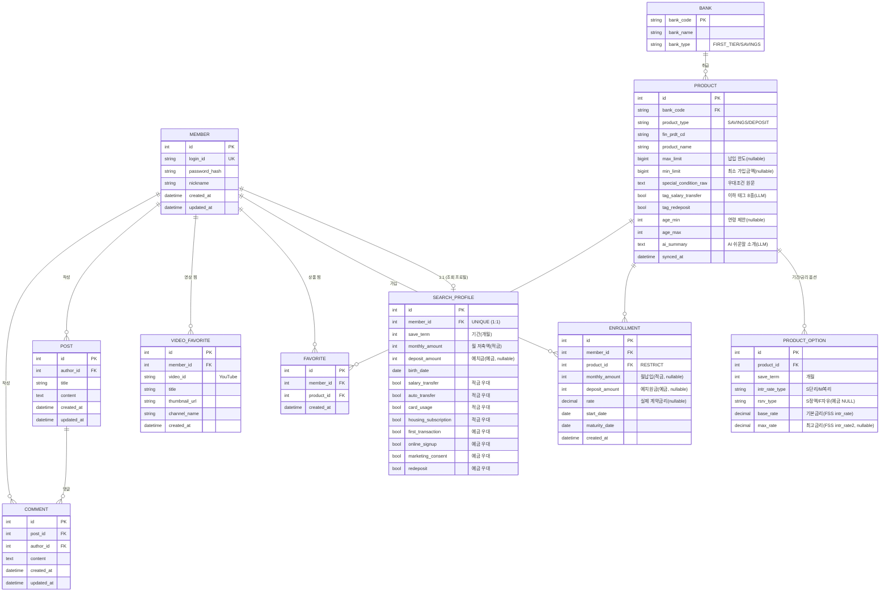

# OurWish 데이터 모델 (ERD)

> Django 모델 기준. PK는 모든 모델이 기본 `id`(AutoField)이며, **API 응답(JSON)에서는 `_id`** 로 내려간다(serializer `source="id"`).

---

## 1. ERD

---

## 2. 테이블 요약

| 테이블 | 역할 | 핵심 제약 |
| --- | --- | --- |
| `member` | 계정(로그인/식별) | `login_id` UNIQUE |
| `search_profile` | 추천 입력값(STEP1·2) | `member` **1:1** |
| `bank` | 은행(권역) | `bank_code` PK, `bank_type`로 1금융/저축은행 구분 |
| `product` | 적금·예금 상품 | `(bank, fin_prdt_cd)` UNIQUE |
| `product_option` | 기간별 금리 옵션 | `(product, save_term, intr_rate_type, rsrv_type)` UNIQUE |
| `enrollment` | 내가 가입한 상품 | `(member, product)` UNIQUE, product는 RESTRICT |
| `favorite` | 상품 찜 | `(member, product)` UNIQUE |
| `video_favorite` | 영상 찜 | `(member, video_id)` UNIQUE |
| `post` / `comment` | 커뮤니티 글/댓글 | post:comment = 1:N |

---

## 3. 설계 의사결정

- **계정과 조회 프로필 분리 (`Member` 1:1 `SearchProfile`)** — `Member`는 인증/식별만 책임지고, 추천에 쓰는 입력값(기간·금액·나이·우대조건)은 `SearchProfile`로 떼어냈다. 조회는 자주 바뀌지만 계정 정보는 고정이기 때문. 다음 조회 때 기존 값을 prefill해 변경분만 수정한다.

- **`Goal` 모델 폐기 → `SearchProfile`로 흡수** — 초기엔 목표(Goal)를 따로 뒀으나, 추천 입력값과 사실상 같아 통합했다. `goals` 앱은 테이블을 DROP하는 마이그레이션 껍데기만 남아 있다.

- **적금/예금 2트랙을 한 모델 안에서 구분** — `SearchProfile`은 금액을 `monthly_amount`(적금, 월납입)와 `deposit_amount`(예금, 예치원금)로 나눠 갖고, 우대조건 태그도 상품군마다 다른 4종을 쓴다(적금: 급여이체·자동이체·카드·청약 / 예금: 첫거래·비대면·마케팅·재예치).

- **`Product` 태그·연령·요약은 LLM 산출물** — `tag_*` 8종, `age_min/max`, `min_limit`, `ai_summary`는 FSS 원문이 구조화돼 있지 않아 GMS 배치가 채운다. 단, **금리(`base_rate`/`max_rate`)는 FSS 구조화 필드만 신뢰**하고 태그는 별개 신호로 둔다(상세는 `ALGORITHM.md`).

- **`Enrollment` 2단계 채움** — ① 상품 등록 시엔 `member`·`product`만, ② 정보 입력 단계에서 금액·금리·날짜를 유저가 입력한다. 그래서 상세 필드는 모두 nullable. 달성 게이지는 저장하지 않고 **조회 시점에 기간 비율로 계산**한다.

- **`VideoFavorite`는 표시용 메타 캐싱** — YouTube는 외부 데이터라 FK가 없다. 찜 목록을 매번 YouTube에 다시 묻지 않도록 제목·썸네일·채널명을 등록 시점에 함께 저장한다.

- **PK 네이밍** — 모든 모델 PK는 기본 `id`. ERD 문서엔 `_id`로 표기돼 있으나 실제 컬럼은 `id`이고, **JSON 응답에서만** serializer가 `_id`로 노출한다.
