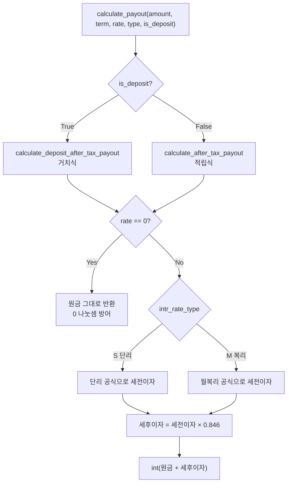

# 예상 세후 수령액 계산 로직

> 대상 파일: `backend_dir/apps/products/services.py` (92줄)
> 관련 테스트: `backend_dir/apps/products/tests.py` — `AfterTaxPayoutTest`

OurWish의 모든 금액 표시(추천 목록 정렬, 찜 목록, 상세 계산기)의 기준이 되는
**만기 세후 수령액** 산식을 정리한 문서다.

---

## 1. 핵심 원칙 3가지

### 원칙 1 — 수령액 = 원금 + 세후이자

세금은 **이자에만** 붙는다. 원금은 내 돈을 돌려받는 것이므로 과세 대상이 아니다.

```
수령액 = 원금 + (세전이자 × (1 - 0.154))
```

### 원칙 2 — 적금과 예금은 산식이 다르다

| 구분 | 방식 | 이자 계산 기준 |
|---|---|---|
| **예금** (DEPOSIT) | 거치식 — 목돈을 한 번에 넣고 만기까지 둠 | 원금 전액이 전 기간 이자를 받음 |
| **적금** (SAVINGS) | 적립식 — 매달 나눠서 넣음 | 납입 회차마다 이자 기간이 다름 |

적금에서 첫 달 납입금은 12개월치 이자를 받지만, 마지막 달 납입금은 1개월치만 받는다.
그래서 "월 10만 × 12개월 = 120만"이어도 이자는 120만원을 1년 굴린 값의 **약 54%**만 나온다.

### 원칙 3 — 원 미만은 절사

`int()`로 버린다. 반올림이 아니다.

---

## 2. 계산 흐름



---

## 3. 세율 상수

```python
# 이자소득세율 15.4% = 소득세 14% + 지방소득세 1.4%. 원금이 아니라 '이자'에만 부과한다.
TAX_RATE = Decimal("0.154")
```

`float`이 아니라 `Decimal`을 쓴다. 돈 계산에서 `0.1 + 0.2 != 0.3`이 되는
부동소수점 오차를 피하기 위함이다.

---

## 4. 적금(적립식) 산식

### 4-1. 단리 (`intr_rate_type == 'S'`)

납입 회차별로 남은 개월 수가 다르므로, **1개월 + 2개월 + ... + n개월**을 합산한다.
이 합은 등차수열 합 공식으로 한 번에 구한다.

```
months_sum = n × (n+1) / 2
세전이자 = 월납입액 × (연이율/12) × months_sum
```

12개월이면 `1+2+...+12 = 78`. 즉 "월 납입액 × 월이율 × 78개월분"이다.
(120만원을 1년 통째로 굴린 144개월분과 비교하면 약 54%)

### 4-2. 복리 (`intr_rate_type == 'M'`) — 월복리

적립식 연금의 미래가치(FV of annuity) 공식을 쓴다.

```
월이율 r = 연이율 / 12
만기잔액 = 월납입액 × ((1 + r)^n - 1) / r
세전이자 = 만기잔액 - 원금
```

### 4-3. 코드

```python
def calculate_after_tax_payout(monthly_amount, term_months, annual_rate, intr_rate_type):
    """정액적금 만기 세후 수령액(원금 + 세후이자)을 '원' 단위 정수로 돌려준다.

    monthly_amount: 매월 납입액(원, int)
    term_months:    납입 개월 수(int)
    annual_rate:    연이율(%) — 예: 3.50
    intr_rate_type: 'S'(단리) 또는 'M'(복리)
    """
    principal = monthly_amount * term_months              # 총 납입 원금
    rate = Decimal(str(annual_rate)) / Decimal(100)       # %(3.50) -> 소수(0.035)

    if rate == 0:                                         # 0% 방어: 이자 0 + 0 나눗셈 방지
        return principal

    if intr_rate_type == ProductOption.IntrRateType.SIMPLE:    # 단리(S)
        months_sum = term_months * (term_months + 1) // 2      # 1+2+...+n (개월)
        pre_tax_interest = monthly_amount * (rate / 12) * months_sum
    else:                                                      # 복리(M) — 월복리
        monthly_rate = rate / 12
        balance = monthly_amount * (((1 + monthly_rate) ** term_months) - 1) / monthly_rate
        pre_tax_interest = balance - principal

    after_tax_interest = pre_tax_interest * (1 - TAX_RATE)     # 이자에만 과세
    return int(principal + after_tax_interest)                # 원 미만 절사
```

---

## 5. 예금(거치식) 산식

### 5-1. 단리

원금 전액이 전 기간 동안 이자를 받으므로 단순하다.

```
세전이자 = 원금 × 연이율 × (개월수 / 12)
```

### 5-2. 복리 — 월복리

```
월이율 r = 연이율 / 12
만기잔액 = 원금 × (1 + r)^n
세전이자 = 만기잔액 - 원금
```

### 5-3. 코드

```python
def calculate_deposit_after_tax_payout(principal, term_months, annual_rate, intr_rate_type):
    """거치식(예금) 만기 세후 수령액(원금 + 세후이자)을 '원' 단위 정수로 돌려준다.

    적금(적립식)과 달리 목돈을 가입 시점에 한 번에 넣고 만기까지 그대로 둔다.
    principal:      예치금(원, int)
    term_months:    예치 기간(개월, int)
    annual_rate:    연이율(%) — 예: 3.50
    intr_rate_type: 'S'(단리) 또는 'M'(복리, 월복리로 계산)
    """
    rate = Decimal(str(annual_rate)) / Decimal(100)        # %(3.50) -> 소수(0.035)

    if rate == 0:                                           # 0% 방어: 이자 0
        return principal

    if intr_rate_type == ProductOption.IntrRateType.SIMPLE:    # 단리(S)
        pre_tax_interest = principal * rate * Decimal(term_months) / Decimal(12)
    else:                                                       # 복리(M) — 월복리
        monthly_rate = rate / 12
        balance = principal * ((1 + monthly_rate) ** term_months)
        pre_tax_interest = balance - principal

    after_tax_interest = pre_tax_interest * (1 - TAX_RATE)     # 이자에만 과세
    return int(principal + after_tax_interest)                # 원 미만 절사
```

---

## 6. 분기 진입점

상품군에 따라 위 두 함수 중 하나로 보내주는 얇은 래퍼.

```python
def calculate_payout(amount, term_months, annual_rate, intr_rate_type, is_deposit):
    """상품군에 맞는 산식으로 세후 수령액 계산 (적금=적립식, 예금=거치식)."""
    if is_deposit:
        return calculate_deposit_after_tax_payout(
            amount, term_months, annual_rate, intr_rate_type
        )
    return calculate_after_tax_payout(amount, term_months, annual_rate, intr_rate_type)
```

---

## 7. 대표 옵션 선정

한 상품(`Product`)에는 기간별 옵션(`ProductOption`)이 여러 개 달려 있다.
목록에 한 줄로 보여주려면 그중 하나를 "대표"로 뽑아야 하는데,
**세후 수령액이 가장 큰 옵션**을 기준으로 삼는다.

```python
def best_option_by_payout(options, amount, use_max, is_deposit):
    """옵션 중 세후 수령액이 가장 큰 것을 (option, payout)으로 반환. 옵션이 없으면 None.

    use_max=True면 최고금리(없으면 기본금리로 폴백), False면 기본금리로 계산한다.
    추천 목록(#7)과 찜 목록이 '대표 옵션'을 같은 기준으로 고르도록 공용화했다.
    """
    best = None
    for option in options:
        rate = (
            option.max_rate
            if use_max and option.max_rate is not None
            else option.base_rate
        )
        payout = calculate_payout(
            amount, option.save_term, rate, option.intr_rate_type, is_deposit
        )
        if best is None or payout > best[1]:
            best = (option, payout)
    return best
```

### `use_max` 결정 규칙

`products/views.py`의 추천 API에서 정렬 파라미터로 결정된다.

```python
use_max = sort in ("max", "all")  # base만 기본금리, 나머지는 최고금리
```

| `sort` 값 | 사용 금리 |
|---|---|
| `base` | 기본금리 (`base_rate`) |
| `max` | 최고금리 (`max_rate`, 없으면 기본금리 폴백) |
| `all` | 최고금리 |

---

## 8. 호출 지점

| 위치 | 용도 |
|---|---|
| `apps/products/views.py:206` | 추천 목록 — 필터 통과 상품마다 대표 옵션 계산 |
| `apps/favorites/views.py:83` | 찜 목록 — 추천과 동일 기준으로 재계산 |
| `apps/products/tests.py` | 단위 테스트 |

### 추천 목록에서의 정렬

계산된 수령액이 그대로 정렬 키가 된다.

```python
# 세후 수령액 내림차순, 동률이면 product_id 오름차순
results.sort(key=lambda item: (-item["expected_payout"], item["product_id"]))
```

동률일 때 `product_id`로 2차 정렬하는 이유는 **페이지네이션 안정성** 때문이다.
정렬 기준이 불안정하면 2페이지를 요청했을 때 1페이지에 나온 상품이 또 나올 수 있다.

### 응답 필드

`_build_item()`이 만드는 항목 중 금액 관련 부분:

```python
"save_term": option.save_term,
"base_rate": float(option.base_rate),
"max_rate": float(option.max_rate) if option.max_rate is not None else None,
"expected_payout": expected_payout,
```

---

## 9. 검증된 수치

`tests.py`의 `AfterTaxPayoutTest` — 월 10만원 × 12개월 기준.

| 조건 | 원금 | 세후이자 | 수령액 |
|---|---|---|---|
| 단리 3.0% | 1,200,000 | 16,497 | **1,216,497** |
| 복리(월복리) 3.0% | 1,200,000 | 14,075 | **1,214,075** |
| 이율 0% | 1,200,000 | 0 | **1,200,000** |

### 복리가 단리보다 적은 이유

버그가 아니다. 이 코드의 단리 공식은 "매 납입분에 만기까지 단리를 붙이는"
실제 적금 방식(`months_sum` 누적)이라 기본 이자량 자체가 크다.
반면 월복리 연금 공식은 초기 납입분의 복리 효과가 12개월이라는 짧은 기간에는
그 차이를 따라잡지 못한다. 기간이 길어질수록 격차는 줄어든다.

### 0% 방어가 필요한 이유

복리 분기에서 `/ monthly_rate` 나눗셈이 있기 때문에,
`rate == 0`을 먼저 걸러내지 않으면 `ZeroDivisionError`가 난다.

---

## 10. 프론트엔드 공용 계산 모듈

상세 계산기와 STEP1 예상 수령액은 사용자가 금액·기간·금리를 즉시 바꿔보는 화면이라
백엔드 왕복 없이 프론트에서 계산한다. 산식은 `src/utils/payout.ts` 한 곳에만 둔다.

| 함수 | 대응하는 백엔드 함수 |
|---|---|
| `calculateSavingsPayout()` | `calculate_after_tax_payout()` |
| `calculateDepositPayout()` | `calculate_deposit_after_tax_payout()` |
| `calculatePayout()` | `calculate_payout()` |

```ts
export const TAX_RATE = 0.154
export type IntrRateType = 'S' | 'M'
export type PayoutResult = {
  principal: number        // 원금(원)
  afterTaxInterest: number // 세후이자(원)
  total: number            // 원금 + 세후이자(원)
}
```

### 단위 규칙

산식은 백엔드와 동일하게 **원** 단위로 계산한다.
화면 입력·표시는 만원 단위이므로 호출부에서 `toWon()` / `toManwon()`으로 감싼다.

```ts
const payout = computed(() =>
  calculateSavingsPayout(toWon(calcAmount.value), calcPeriod.value, calcRate.value, props.intrRateType),
)
const totalAmount = computed(() => toManwon(payout.value.total))
```

`toManwon()`은 `Math.round(원 / 10000)`으로, 추천 목록이 서버의 `expected_payout`을
만원으로 바꾸는 방식(`RecommendationView.vue:230`)과 같다.

### 절사 위치

백엔드는 `int(원금 + 세후이자)`로 총액을 절사한다. 프론트는 세후이자만
`Math.floor()`한 뒤 원금을 더하는데, 원금이 정수이므로 결과는 같다.

```ts
const afterTaxInterest = Math.floor(preTaxInterest * (1 - TAX_RATE))
return { principal, afterTaxInterest, total: principal + afterTaxInterest }
```

### 호출 지점

| 파일 | 용도 | `intr_rate_type` 출처 |
|---|---|---|
| `views/GoalSetupView.vue` | STEP1 평균금리 기준 예상 수령액 | 상품이 아닌 시장 평균이라 `'S'` 고정 |
| `components/ProductDetail/SavingsCalcModal.vue` | 적금 상세 계산기 | `ProductHeaderCard`가 prop으로 전달 |
| `components/ProductDetail/DepositCalcModal.vue` | 예금 상세 계산기 | 동일 |

`ProductHeaderCard`는 `product.intr_rate_type`이 `'M'`이면 복리, 아니면 단리로 넘긴다.
상세 API의 `intr_rate_type`은 `save_term`이 목표 기간과 맞는 옵션에서 뽑은 값이다
(`SavingsDepositDetailView.vue`의 `buildProduct()`).

### 남는 오차 — Decimal vs float

백엔드는 `Decimal`, 프론트는 JS `number`(float)라 절사 경계에서 ±1원이 갈릴 수 있다.
금액·기간·금리·단복리 588개 조합을 대조한 결과 8건에서 1원 차이가 났고,
모두 기간 1개월 복리처럼 이자가 극히 작은 구간이었다.
화면은 만원 단위로 반올림해 표시하므로 사용자에게는 드러나지 않는다.

---

## 11. 용어 정리

| 용어 | 의미 |
|---|---|
| 원금 (principal) | 적금은 `월납입액 × 개월수`, 예금은 예치금 그대로 |
| 세전이자 (pre_tax_interest) | 세금 떼기 전 이자 |
| 세후이자 (after_tax_interest) | `세전이자 × 0.846` |
| `base_rate` | 우대조건 없이 누구나 받는 기본금리 |
| `max_rate` | 우대조건 모두 충족 시 최고금리 |
| `save_term` | 가입 기간(개월) |
| `intr_rate_type` | `'S'` 단리 / `'M'` 복리 |
